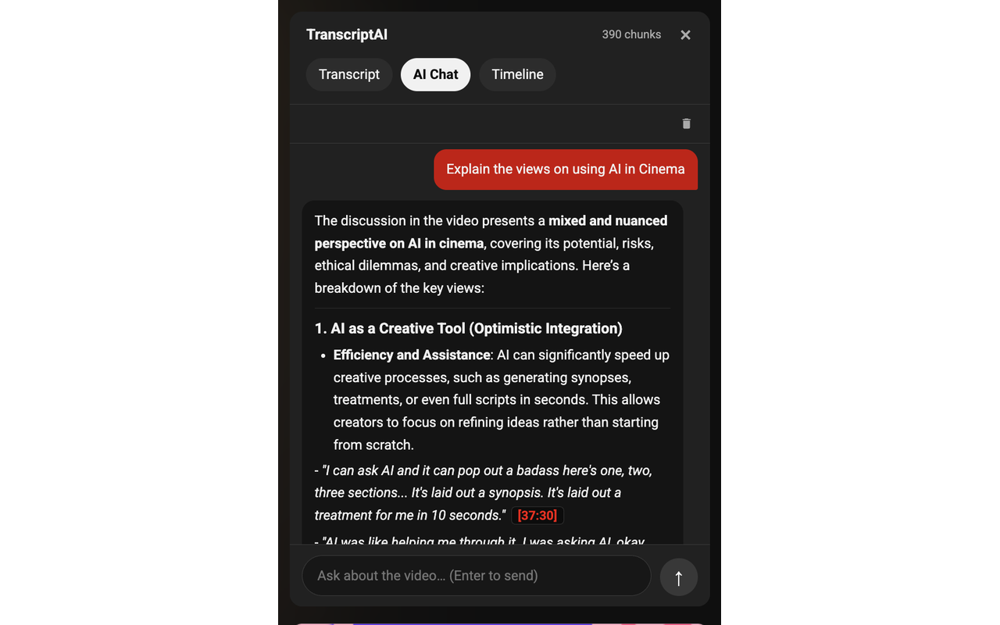
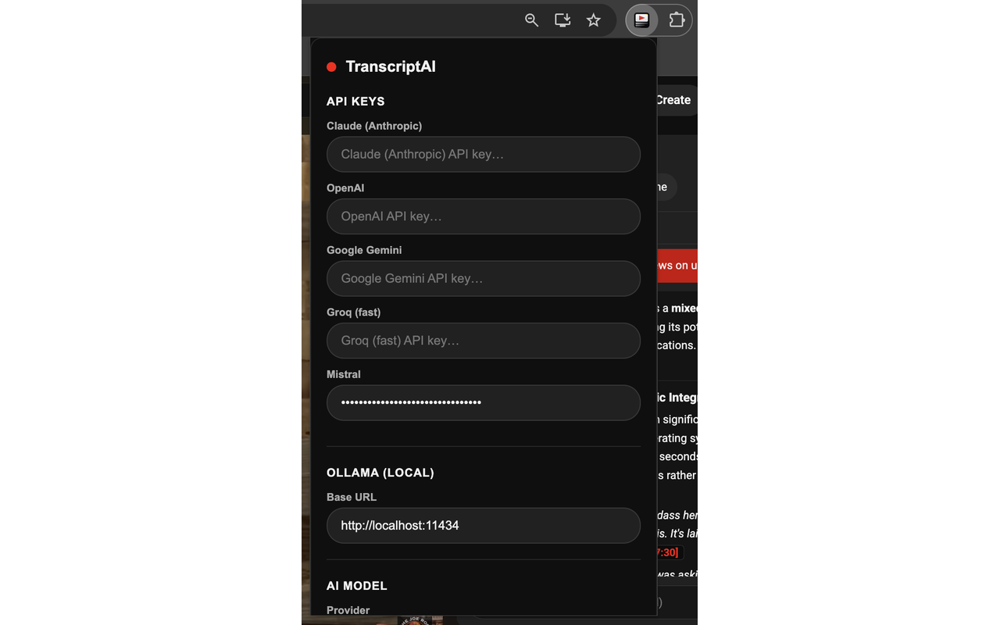
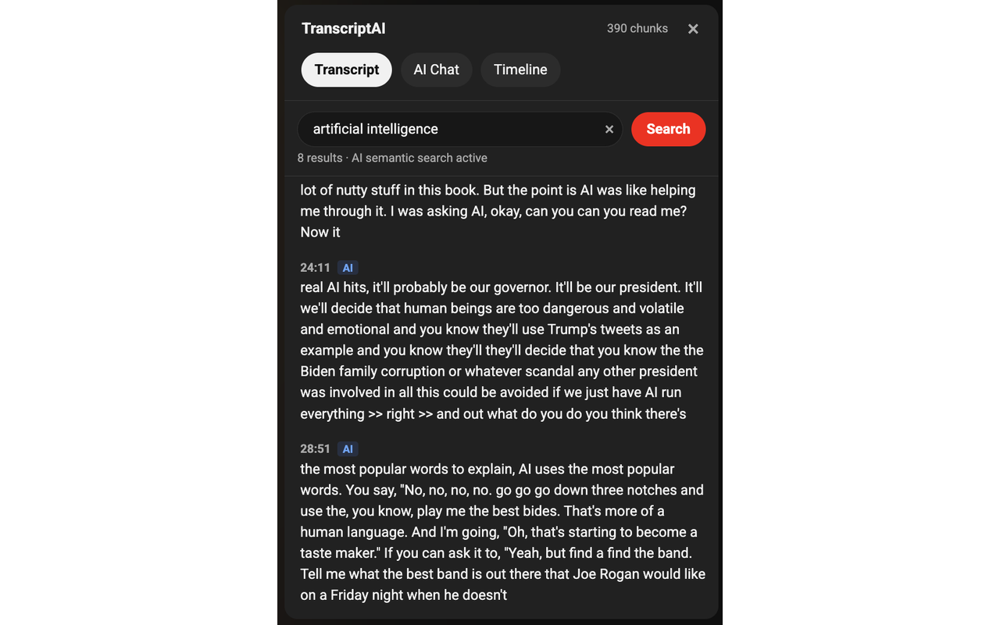

# YouTube Transcript & AI

A Chrome extension that adds a **Transcript & AI** panel directly inside YouTube's native UI — no popups, no overlays. Search transcripts, follow along in real time, and chat with any AI provider about the video.


---

## Features

- **Real-time transcript** — auto-scrolls with the video; click any line to seek
- **Inline search** — exact keyword or semantic (AI-powered) search with highlighted matches
- **AI chat** — ask questions about the video; responses include clickable timestamp citations
- **Multi-provider** — Anthropic, OpenAI, Google Gemini, Groq, Mistral, or local Ollama
- **Native theme** — automatically follows YouTube's dark/light mode

## Screenshots

| | |
|---|---|
|  |  |
|  | |

---

## Installation

1. Clone the repo and install dependencies:
   ```bash
   npm install
   ```
2. Build the extension:
   ```bash
   npm run build
   ```
3. Open `chrome://extensions`, enable **Developer mode**, click **Load unpacked**, and select the `dist/` folder.

## Development

```bash
npm run dev   # watch mode — rebuilds on save
```

---

## Configuration

Open the extension popup and enter your API key for the provider you want to use:

| Provider | Needs key |
|---|---|
| Anthropic | Yes |
| OpenAI | Yes |
| Google Gemini | Yes |
| Groq | Yes |
| Mistral | Yes |
| Ollama (local) | No |

Semantic search uses `all-MiniLM-L6-v2` (~23 MB), downloaded once and cached in the browser.

---

## Tech Stack

- **React 18 + TypeScript** bundled with Vite + `@crxjs/vite-plugin`
- **Vercel AI SDK** for streaming chat across providers
- **@huggingface/transformers** for in-browser embeddings
- **Tailwind CSS** + YouTube CSS variables for theming
